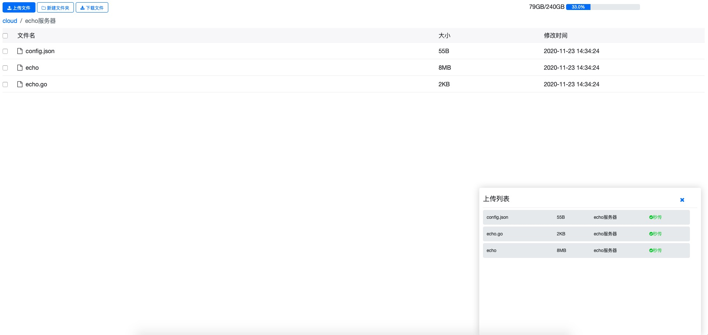

# fileCloud

仿百度网盘，实现个人文件存储云盘。


## 页面展示



## 分片上传、断点续传

文件过大时，上传文件需要很长时间，且中途退出将导致文件重传。

分片上传: 上传文件时，在本地将文件按照 2M 的大小将文件进行分片。在服务器端将文件组合。

断点续传: 如果文件没有上传完，关闭客户端。再一次上传文件时，对比服务器已经上传的分片，只需要上传没有的分片。

程序重启时，由于不保存目录结构和上传进度。会删除已经上传的文件分片，再次上传从头开始。

## 秒传

每一个文件都有对应的md5码。当检测上传文件时，如果本地已经存在相同md5的文件，则不需要用户上传。

## 文件保存方案

SaveFileMultiple 文件是否保存为多份。

已经存在md5文件时
- 当 SaveFileMultiple=false，仅添加文件指向，当前文件夹下不存在该文件，即整个云盘只存在一份源文件。
删除时，判读文件引用，当引用为0时执行文件的删除;若删除源文件且还有文件引用，将文件移动到引用处。
- 当 SaveFileMultiple=true，会将源文件拷贝一份到当前目录。整个云盘存在多份文件，磁盘占用为N倍。删除时，直接删除当前文件。

由于不设计目录结构的保存，故 SaveFileMultiple=false时，程序重启会恢复到真实目录文件结构。

## 不做目录结构和文件上传分片保存说明

目录结构，文件上传分片保存在内存中。程序重启后会丢失信息。

若目录文件存在手动修改，保存信息后重启将导致文件数据不匹配，保不保存意义不大。

若目录文件不存在手动修改，仅有 SaveFileMultiple=false 时,重启时需要还原到停机状态才需要保存信息。
而 SaveFileMultiple=true，重启加载目录与停机时一致，不需要保存信息。

故重启目录结构显示是真实的目录结构。上传的文件分片会在重启加载时删除。

## 接口

```
hServer.HandleFuncUrlParam("/file/list", fileList) // 当前路径列表
hServer.HandleFuncUrlParam("/file/delete", fileDelete) // 删除文件、文件夹
hServer.HandleFuncUrlParam("/file/mkdir", fileMkdir) // 创建目录
hServer.HandleFuncJson("/file/check", &fileCheckReq{}, fileCheck) // 文件上传时调用，检查文件是否已经存在
hServer.HandleFunc("/file/upload", fileUpload) // 文件上传，分片上传。
hServer.HandleFuncUrlParam("/file/download", fileDownload) // 文件下载，暂时只支持文件
hServer.HandleFuncUrlParam("/file/action", fileAction) // 文件移动、拷贝到指定目录
```

## todo

文件移动、拷贝。

## 欢迎PR,ISSUES

个人能力有限，前端的东西不太会。很多都是边查资料边做的，希望有这方面的大佬把前端的代码改改。

## 启动

`go get github.com/yddeng/filecloud`

1. config.toml

```
WebAddr  = "127.0.0.1:9987"      # web 地址
WebIndex = "./app"               # web html目录
FilePath = "cloud"               # 文件存放目录
SliceSize = 2                    # 上传分片大小，单位MB
SaveFileMultiple = false         # 文件是否保存为多份。
```

2. `go run server/main/filecloud.go config.toml` 

3. 浏览器访问 webAddr。用 `http` 方式访问。


